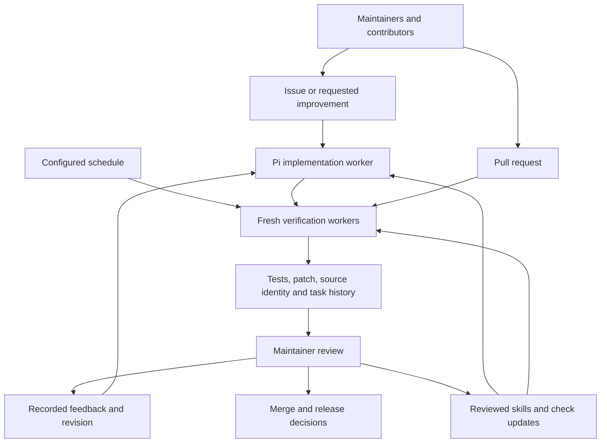

# Numinous Forge on Darkbloom

Forge takes an issue, a requested change, or a pull request through isolated execution and verification. This fork shows the resulting code and the evidence behind it. [Upstream Darkbloom](https://github.com/Layr-Labs/d-inference) and its production systems are unchanged.

| Work | Result to inspect |
|---|---|
| Maintain: repair reconnect reputation | [PR #4](https://github.com/numinous-technology/d-inference/pull/4), [regression proof](evidence/issue-regression-proof.json), [task history](evidence/issue-task.json) |
| Repair CI findings: remove streaming lock dependency | [PR #5](https://github.com/numinous-technology/d-inference/pull/5), [regression proof](evidence/streaming-regression-proof.json), [task history](evidence/streaming-task.json) |
| Build: add protocol fuzz coverage | [PR #2](https://github.com/numinous-technology/d-inference/pull/2), [task history](evidence/prompted-task.json) |
| Review: reject broken code | [Closed PR #1](https://github.com/numinous-technology/d-inference/pull/1), [failing CI evidence](evidence/rejected-ci-task.json) |
| Stabilize verification: repair asynchronous test fixtures | [PR #6](https://github.com/numinous-technology/d-inference/pull/6), [before/after proof](evidence/fixture-regression-proof.json), [PR CI](evidence/fixture-ci-task.json) |
| Repeat: run a scheduled check | [Verified occurrence](evidence/scheduled-task.json), [both policy-bound occurrences](evidence/schedule-promotion.json); schedule paused after verification |



Maintainers choose scope, resolve behavior questions, and review merges and releases. Contributors bring issues, improvements, and PRs. Forge implements scoped work, runs accepted checks, records attempts, and cleans up workers. Agent output is a candidate until separate verification passes.

The repair demonstrates review as part of the process: the first candidate passed its initial tests but review found a history-selection flaw. Recorded feedback led to a revised candidate and additional tests against memory and real PostgreSQL. Those lessons become versioned checks and skills for future tasks; existing tasks retain their original policy.

CI also exposed a separate pre-existing streaming lock dependency. We retained the failed CI result, reproduced the lock ordering, and submitted a focused repair through the prompted-work lane. When the fork advanced during that task, an explicit continuation carried its reviewed patch and feedback onto the new source; [the superseded task](evidence/streaming-superseded-task.json) remains recorded. A later implementation timed out before exporting its candidate; [the recovery record](evidence/streaming-recovery.json) identifies the successful edits reconstructed from its retained transcript and the new task that verifies them. The platform now preserves unfinished patches on agent deadlines, with a deployed timeout regression in its qualification. CI does not automatically rewrite arbitrary failed PRs; an operator scopes the repair.

## Review the checks and agent instructions

The [accepted policy snapshot](policy/darkbloom.json) lists profiles and required checks. [Engineering instructions](policy/skills/engineering.md) and [reputation instructions](policy/skills/reputation.md) carry reviewed lessons into future tasks. Their [manifest](policy/manifest.json) binds the files to the qualified deployment. Changes can be proposed in this fork; Numinous reviews and deploys them before they affect future work. A candidate PR cannot replace its own accepted checks.

## Inspect the evidence

[Infrastructure qualification](evidence/qualification.json) records the tested build and deployment scope. [Qualification history](evidence/qualification-attempts.json) retains failed attempts and their corrections. [Repair PR CI](evidence/issue-ci-task.json) and [prompted PR CI](evidence/prompted-ci-task.json) record verification of each PR's merge with the target branch.

With operator access to the installed CLI:

```sh
numinous-forge task list
numinous-forge task get 66257843079c685ec7a310c33395c780
numinous-forge task export 66257843079c685ec7a310c33395c780 ./repair-evidence
numinous-forge schedule runs qualification-protocol
```

Public receipts omit credentials and private infrastructure details. Operator exports contain the complete input, review notes, attempts, logs, and artifact manifests. The platform source is [Numinous Forge](https://github.com/numinous-technology/numinous-forge), currently private.

## Deployment boundary

This deployment covers one project and two concurrent Linux workers. Native Mac/provider, Rust sidecar, and browser-specific coverage are unavailable and block affected CI work. Slack is not installed. Schedules use explicitly pinned commits. The controller is a single instance; durable state and evidence live in Aurora and S3.

GitHub Actions submits work through a restricted AWS OIDC role; candidate code receives no GitHub or AWS account credentials. Verification uses accepted policy and the pinned PR merge. Inherited upstream deployment and release workflows are disabled in this fork. This demonstration does not claim that all upstream issues are fixed or that unsupported environments were tested.
