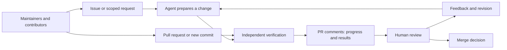

# Numinous Forge on Darkbloom

**Two coordinator bug fixes and two test improvements are merged into this fork.**
Forge prepared scoped changes and ran independent verification; review led to
revisions and stronger checks. Upstream Darkbloom is unchanged.

**Start here: [the reconnect repair, explained in one PR comment](https://github.com/numinous-technology/d-inference/pull/4#issuecomment-5559327139).**
It covers the bug, fix, failed-before/passed-after evidence, and the review finding
that changed the first candidate. No downloads or CLI access needed.

| Change | What the checks demonstrated | Read the PR summary |
|---|---|---|
| Preserve reputation on reconnect | Original code fails; repair passes identity and history-selection cases in memory and real PostgreSQL. | [Repair and review](https://github.com/numinous-technology/d-inference/pull/4#issuecomment-5559327139) |
| Remove a streaming lock dependency | Holding the registry lock reproduces the delay; the repair passes without relaxing the two-second deadline. | [Repair and review](https://github.com/numinous-technology/d-inference/pull/5#issuecomment-5559327450) |
| Add protocol fuzz coverage | New tests pass; deliberately exposing a private diagnostic field makes them fail. | [Coverage and review](https://github.com/numinous-technology/d-inference/pull/2#issuecomment-5559327720) |
| Stabilize asynchronous test fixtures | Original fixture failed 6/20 repetitions; repaired fixtures pass 20 race-test repetitions with assertions preserved. | [Test fixes and review](https://github.com/numinous-technology/d-inference/pull/6#issuecomment-5559328006) |
| Reject broken behavior | Reconnect regressions fail even when other checks pass. This deliberate negative example was closed unmerged. | [Failed verification explained](https://github.com/numinous-technology/d-inference/pull/1#issuecomment-5559328293) |

The repair and test-improvement PRs also passed separate verification of their
merge with the target branch. Each comment states which checks ran and links to
the code; a passing check is evidence for review, not a substitute for it.

## What happens on a PR

- **Follow progress in the conversation.** One CI comment updates as checks run;
  an attached engineering task has a separate progress comment.
- **Review the explanation.** A change summary describes the problem, fix,
  verification results, and review focus. It is separate from live progress.
- **Respond to failure.** Read the reported check and linked workflow, fix the
  change, and push a new commit. CI reruns; ordinary comments do not launch agents.
- **Decide what ships.** Maintainers review behavior and tests before merging.

[See the comments exercised through a failure, correction, and passing result](https://github.com/numinous-technology/d-inference/pull/9#issuecomment-5559328592).

## Checks improve with the code

Reviewed regression tests became required checks. Scheduled protocol checks ran
before and after that update, retaining separate results for each occurrence.
[Read the follow-up in the fuzz-coverage comment](https://github.com/numinous-technology/d-inference/pull/2#issuecomment-5559327720). The demonstration
schedule is paused.

Technical records and agent instructions — optional

The [evidence directory](evidence/) contains machine-readable receipts for audit
and tooling. The [accepted checks](policy/darkbloom.json),
[engineering instructions](policy/skills/engineering.md), and
[reconnect instructions](policy/skills/reputation.md) record the rules used for
this work. Changes to instructions and checks are reviewed before adoption;
a candidate cannot replace the checks judging its own result.

