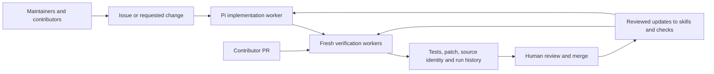

# Numinous Forge on this fork

This fork demonstrates issue repair, prompted engineering work, and pull-request verification on isolated AWS workers. Upstream: [Layr-Labs/d-inference](https://github.com/Layr-Labs/d-inference).



Forge runs the accepted verification policy on fresh EC2 workers. GitHub Actions only submits the commit and reports the outcome; candidate code receives no GitHub or AWS credentials. The verification status belongs to the tested PR commit. Changes to verification policy are promoted by the Forge operator and affect future tasks; existing task evidence retains its original policy.

The demo covers Linux coordinator/protocol checks, regression repair, and durable scheduling. Native Apple Silicon, browser, and Rust-specific coverage are explicitly unsupported in the current policy and block affected PRs. A green result does not mean that those unsupported environments were tested. Inherited upstream workflows are disabled in this fork; deployment and release permissions remain with upstream maintainers.

## Operator entry points

```sh
forge issue solve https://github.com/Layr-Labs/d-inference/issues/747 --profile reputation --reproduction-check reconnect
forge work submit --prompt-file request.md --profile protocol
forge task list
forge task watch TASK_ID
forge task export TASK_ID ./evidence
forge task publish TASK_ID
forge schedule list
```

Issue tasks must first demonstrate their accepted regression test failing. Agent output then goes through fresh verification. Publication checks the candidate tree against the verified tree and opens a draft PR in this fork. Human review decides whether it should merge or be proposed upstream.

The platform is maintained in [Numinous Forge](https://github.com/numinous-technology/numinous-forge). The platform repository is currently private; this fork's CI results and repair PRs are public evidence.
