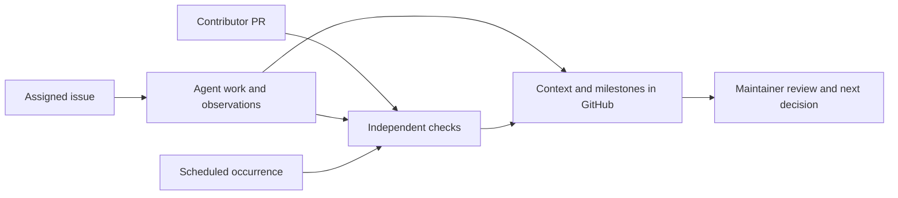

# Numinous Forge on Darkbloom

Forge works alongside contributors and maintainers in GitHub. Open a PR and
follow the verification conversation there. For assigned engineering work, the
issue records the plan and findings; the resulting PR explains the change and
its independently recorded checks.

## Follow the work

- **Contributor PR:** Your description starts the conversation. Forge responds
  with the behaviors it will check, reports findings, and explains the result.
  New commits trigger a new verification run.
- **Requested change:** The issue describes the desired outcome. An assigned
  agent reports its plan and useful discoveries as it works. A verified candidate
  becomes a draft PR for review, with separate checks on the proposed merge.
- **Scheduled check:** Each new occurrence reports in its tracking issue. The
  current overview shows the latest result; milestone comments preserve the
  history of individual occurrences.

A current-work comment answers **where are we now?** Separate milestone comments
explain discoveries, failures, changes of direction, and completion. Each result
identifies its source revision. Agent observations are distinguished from
recorded verification; a proposed patch is not a passing result.

Maintainers choose scope, resolve behavior questions, and decide what merges.
CI verifies a contributor's code without automatically modifying it. Ordinary
comments do not trigger additional engineering work.

## How Forge communicates

The [communication guide](communication.md) defines what an update should explain.
Its purpose is to make the PR conversation sufficient for review: what changed,
why, what the checks proved, and what still needs a decision. Logs and
[machine-readable records](evidence/) support deeper investigation when needed.

The integration is installed in this fork. Upstream Darkbloom is unchanged.
