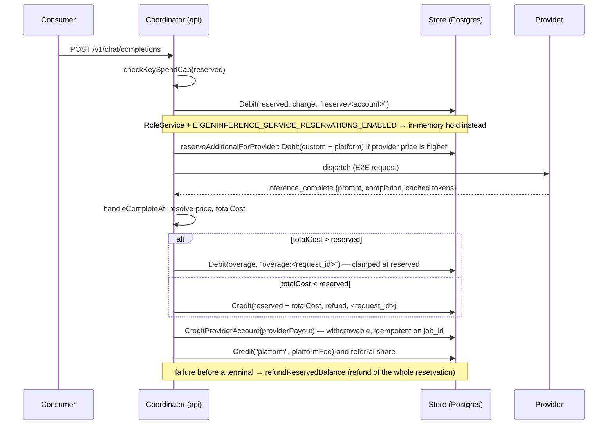

# Billing: pricing, reservations, ledger, and payouts

> Last updated: 2026-09-05 · commit `120ecc9c2`

Darkbloom is prepaid. A consumer account holds an integer micro-USD balance;
the coordinator reserves the worst-case cost of a request before dispatch,
settles the provider-reported cost after the terminal message, and credits the
provider a withdrawable share that it withdraws through Stripe. Connect and the Global Payouts adapter share the earned-balance ledger. This
page explains the money path and what it guarantees. Constants, formulas,
routes, and env vars are tabulated in
[`reference/pricing-model.md`](../reference/pricing-model.md); the consumer
how-to is [`consumer/billing.md`](../consumer/billing.md).

## Context

- **Prepaid, reservation-first.** There is no post-paid billing. A request is
  admitted only after its worst-case cost is debited (or held), so a provider
  can never be owed money the consumer does not have. The reservation bound is
  what makes the `max_tokens` ceiling mandatory
  (`coordinator/api/consumer.go`, `defaultMaxOutputTokens` comment).
- **One unit.** Every balance, price, reservation, and ledger row is an
  `int64` in micro-USD (1 USD = 1,000,000 µUSD). Prices are µUSD per
  1,000,000 tokens. Stripe is the only boundary where amounts become integer
  cents (`coordinator/api/billing_handlers.go` `handleStripeWebhook`
  multiplies `AmountTotal` by `10_000`; `coordinator/api/stripe_payouts.go`
  `microUSDToCents`).
- **Accounts.** A consumer is an API-key account or a Privy user
  (`coordinator/api/billing_handlers.go` `resolveAccountID`). A provider
  machine earns only when linked to an account (`registry.Provider.AccountID`).
  The literal account `platform` holds platform prices and platform-fee
  credits. `users.role = "service"` (`coordinator/store/interface.go`
  `RoleService`) marks wholesale partners.
- **Two balance columns.** `balances.balance_micro_usd` is spendable;
  `balances.withdrawable_micro_usd` is the earned subset that Stripe
  may pay out (`coordinator/store/postgres.go` DDL and
  `coordinator/store/postgres_withdrawable_migration.go`).

## Mechanism

### Prices

| Concern | How |
|---|---|
| Storage | `model_prices(account_id, model, input_price, output_price)`, primary key `(account_id, model)`. Platform prices use `account_id = 'platform'`; a provider's custom prices use its own account id (`coordinator/store/postgres.go`). |
| Platform price writers | `PUT /v1/admin/pricing` (`coordinator/api/billing_handlers.go` `handleAdminPricing`) and model registration, which requires positive `input_price`/`output_price` and writes them as the platform row (`coordinator/api/model_registry_handlers.go` `handleRegisterModel` → `SetModelPrice("platform", …)`). |
| Provider custom price | `PUT /v1/pricing` / `DELETE /v1/pricing` for the caller's own account; Privy users only (`coordinator/api/billing_handlers.go` `handleSetPricing`, `handleDeletePricing`). The only validation is `> 0`; there is no floor or ceiling relative to the platform price. |
| Resolution at settlement | provider custom → platform → `DefaultInputPricePerMillion` / `DefaultOutputPricePerMillion` (`coordinator/api/provider.go` `handleCompleteAt`). Service consumers skip the first step. The reservation uses the same order with the provider chosen at dispatch (`coordinator/api/consumer.go` `providerReservationCost`, `reservationCost`). |
| Cost | `calculateCost` bills `promptTokens × in / 1M + completionTokens × out / 1M`. `CalculateCostWithOverrides` then applies `minimumChargeMicroUSD`; `CalculateCostWithOverridesNoMinimum` (service traffic) floors non-zero usage at 1 µUSD instead (`coordinator/payments/pricing.go`). Cached tokens: invariant 5. |
| Public read | `GET /v1/pricing` returns the `platform` rows plus the fallback defaults (`handleGetPricing`); the OpenRouter model feed renders µUSD/1M as USD-per-token strings via `coordinator/payments/pricing.go` `FormatPerTokenUSD`. |

### Request lifecycle



| Step | Function | What happens |
|---|---|---|
| 1. Reserve | `coordinator/api/inference_admission.go` `reserveInferenceBalance` | `reserved = reservationCost(model, max(billingPromptTokens, estimatedPromptTokens), requestedMaxTokens)` at the platform price. The output bound follows the precedence in [pricing-model.md → Formulas](../reference/pricing-model.md#formulas) (`coordinator/api/consumer.go` `ensureMaxTokensBound`; an explicit value is never clamped). The per-key spend cap is checked first (`checkKeySpendCap`), then `reserveInitialBalance` debits the ledger (`LedgerCharge`, reference `reserve:<account>`) or, for a service account with holds enabled, adds to an in-memory hold (`coordinator/api/reservations.go` `serviceReservationManager`). Self-route and a nil billing backend skip the step entirely. |
| 2. Media top-up | `topUpReservationForInlinedMedia` | After remote media is fetched and inlined, the byte-bound prompt estimate is recomputed; if it exceeds the reservation the delta is reserved with the same cap check and mode. |
| 3. Provider top-up | `coordinator/api/consumer.go` `reserveAdditionalForProvider` | If the chosen provider has a custom price above the platform price, the delta is debited after a second spend-cap check against the new total. `ErrInsufficientBalance` excludes that provider and dispatch tries another; when none fits the request fails with 402 (`coordinator/api/dispatch.go` `dispatchPrimary`, `run`). Service consumers and free self-route skip it. If dispatch to that provider then fails, `refundExtra` credits the delta back (metric `billing.reservation_extra_refunds`). |
| 4. Settle | `coordinator/api/provider.go` `handleCompleteAt` | Resolve the price, compute `totalCost`; an owned machine serving its owner's request settles free (`totalCost = 0`). Exactly one of the settlement or refund paths wins the reservation (`registry.PendingRequest.FinalizeReservation` / `MarkReservationFinalized`). Overage: `overage = totalCost − reserved`, clamped so `totalCost ≤ 2 × reserved` (metric `billing.cost_clamped`), then `Debit(overage, "overage:<request_id>")`; if that debit fails `totalCost = reserved`. Underage: `Credit(reserved − totalCost, LedgerRefund, <request_id>)`. Service hold: `Debit(totalCost)` and release the hold; a failed debit zeroes cost and payout (`billing.uncollected_zeroed`). No reservation and not free: `Debit(totalCost)`. |
| 5. Record usage | `handleCompleteAt` | In-memory `payments.Ledger.RecordUsage` always (bounded recent history, lazily allocated to the [usage history limit](../reference/pricing-model.md#constants)); a persistent `usage` row (`RecordUsageFullWithPublicModel`) unless the request was free self-route. |
| 6. Pay out | `handleCompleteAt` | `feePercent` is the consumer's `users.platform_fee_percent` override, else the global default (invariant 4). `platformFee = PlatformFeeWithPercent(totalCost, feePercent)`; `DistributeReferralReward` carves the referrer's share out of it; `CreditProviderAccount` credits `totalCost − platformFee` to the provider's account as withdrawable earnings (only when the provider is linked and the payout is > 0); the remaining fee is credited to `platform` (`LedgerPlatformFee`). |
| 7. Abort / disconnect | `coordinator/api/consumer.go` `refundReservedBalance`; `coordinator/api/settlement.go` `settlementHolder` | A request that fails before any provider terminal refunds the whole reservation (`LedgerRefund`, reference `reservation_refund:<request_id>`). If the consumer disconnects first, the billing record is parked for `defaultTerminalSettleGrace = 30 * time.Second` so a late terminal settles it; otherwise it is refunded. |

### Ledger

Tables (all `CREATE TABLE IF NOT EXISTS` in `coordinator/store/postgres.go`):
`balances`, `ledger_entries(account_id, entry_type, amount_micro_usd,
balance_after, reference, created_at)`, `model_prices`, `billing_sessions`,
`referrers`, `referrals`, `invite_codes`, `invite_redemptions`,
`provider_earnings` (unique partial index `idx_provider_earnings_job` on
`job_id`), `provider_payouts` (legacy), `stripe_withdrawals`,
`provider_floor_draws` (`UNIQUE (provider_key, epoch_id)`), and the
`users.role` / `users.platform_fee_percent` / `users.stripe_*` columns.

Which path writes each `LedgerEntryType` (`coordinator/store/interface.go`),
and which balance column moves:

| Entry type | Written by | Column(s) |
|---|---|---|
| `charge` | reservation, overage, and direct debits — `payments.Ledger.Charge` → `store.Debit` | both (withdrawable capped, invariant 8) |
| `refund` | reservation refund, settlement refund, withdrawal refunds (`refundReservedBalance`, `handleCompleteAt`, `CreditWithdrawableOnce` in `coordinator/api/stripe_payouts_webhooks.go`) | `balance` for reservation/settlement refunds; both for withdrawal refunds |
| `payout` | `provider_earnings` credit path (`CreditProviderAccount` ledger CTE) | both |
| `platform_fee` | `handleCompleteAt` → `store.Credit("platform", …)` | `balance` |
| `referral_reward` | `coordinator/billing/referral.go` `DistributeReferralReward` → `CreditWithdrawable` | both |
| `stripe_deposit` | `handleStripeWebhook` → `Service.CreditDeposit` → `store.Credit` | `balance` |
| `stripe_payout` | `coordinator/api/stripe_withdraw.go` `handleStripeWithdraw` → `CreateStripeWithdrawalWithDebit` | both (guarded by `withdrawable_micro_usd >= amount`) |
| `invite_credit` | `coordinator/api/invite_handlers.go` `handleRedeemInviteCode` → `store.Credit` | `balance` |
| `admin_credit` | `handleAdminCredit` → `store.Credit` | `balance` |
| `admin_reward` | `handleAdminReward` → `CreditWithdrawable` | both |
| `provider_floor_draw` | `coordinator/store/postgres_base_rewards.go` `SettleProviderFloorDraw` | both |
| `migration` | `coordinator/store/postgres.go` `MigrateAccountBalance` (balance moved between account identities) | both |
| `deposit`, `withdrawal` | declared for legacy (pre-Stripe) deposit and on-chain withdrawal paths; no current handler writes them | — |

`RewardLedgerTypes = {referral_reward, admin_reward}` is the set the
leaderboard and `GET /v1/me/summary` count as "reward" rather than "work"
earnings (`coordinator/store/interface.go` `IsRewardLedgerType`;
`coordinator/api/me_handlers.go` `handleMySummary`).

Three credit primitives (`coordinator/store/postgres.go`):

| Primitive | Effect | Used for |
|---|---|---|
| `Credit` (`creditTx`) | raises `balance_micro_usd` only; not reference-idempotent | deposits, invite/admin credits, reservation and settlement refunds, platform fee |
| `CreditWithdrawable` (`creditWithdrawableTx`) | raises both columns; not reference-idempotent | referral rewards, admin rewards |
| `CreditWithdrawableOnce` | `CreditWithdrawable` guarded by a `pg_advisory_xact_lock` on `entry_type:reference` and an existence check on `(account_id, entry_type, reference)`; returns whether it applied | withdrawal principal and fee refunds |

`CreditProviderAccount` and `SettleProviderFloorDraw` are single-statement
CTEs whose first `INSERT … ON CONFLICT DO NOTHING` gates every downstream
credit (invariants 7 and 15).

### Service accounts

`RoleService` is granted by `PUT /v1/admin/users/role` with
`{"role": "service"}` (`""` clears it) (`handleAdminSetUserRole`,
`SetUserRole`). Effects: cost via `CalculateCostWithOverridesNoMinimum`;
billed at the platform price with no provider-custom-price top-up
(`isServiceConsumer`); when
`EIGENINFERENCE_SERVICE_RESERVATIONS_ENABLED=true` (default `false`,
`coordinator/api/server_config.go` `ReadServerConfig`) reservations are
in-memory holds (`mode:service_hold`) and the actual cost is debited at
settlement; requests use the dedicated service rate limiter
(`Service`; values under [pricing-model constants](../reference/pricing-model.md#constants)).
The platform fee follows the same per-user override as everyone else.

### Deposits (Stripe Checkout)

1. `POST /v1/billing/stripe/create-session` (`handleStripeCreateSession`;
   auth + financial limiter) requires `amount_usd` at or above the [Stripe deposit minimum](../reference/pricing-model.md#constants), validates an
   optional `referral_code`, creates a Checkout Session whose metadata carries
   `billing_session_id`, `consumer_key`, and `referral_code`
   (`coordinator/billing/stripe.go` `CreateCheckoutSession`), stores a
   `billing_sessions` row with `status = pending`, and returns
   `{session_id, stripe_session, url, amount_usd, amount_micro_usd}`.
2. Stripe calls `POST /v1/billing/stripe/webhook` (`handleStripeWebhook`; no
   auth, `Stripe-Signature` verified by `VerifyWebhookSignature`). Only
   `checkout.session.completed` is processed; every other event type is
   acknowledged with 200 and ignored.
3. If `metadata.billing_session_id` names a session already `completed`, the
   handler returns 200 without crediting. Otherwise it credits
   `AmountTotal × 10_000` µUSD (`CreditDeposit` → `store.Credit`, entry
   `stripe_deposit`, reference `stripe:<checkout_session_id>`), then marks the
   session complete and applies the referral code — both best-effort (metrics
   `billing.session_complete_failed`, `billing.referral_apply_failed`).
4. `GET /v1/billing/stripe/session?id=<session_id>` polls the row;
   `GET /v1/billing/methods` (public) lists configured methods — Stripe only
   (`coordinator/billing/billing.go` `SupportedMethods`).

Deposits are **not withdrawable** (they use `Credit`). The dedup gap in this
sequence is stated under Failure modes.

### Provider payouts (Stripe Connect Express)

| Stage | Function | Behaviour |
|---|---|---|
| Onboard | `coordinator/api/stripe_payouts.go` `handleStripeOnboard` (Privy only) | Creates or reuses an Express account (`coordinator/billing/stripe_connect.go` `CreateExpressAccount`) with the service agreement chosen by `coordinator/billing/stripe_regions.go` `RequiredServiceAgreement` (`full` or `recipient`), returns a hosted onboarding link (`CreateAccountLink`). Local status ∈ {`""`, `pending`, `ready`, `restricted`, `rejected`} is mirrored from `account.updated`. |
| Status | `handleStripeStatus` | Returns `status`, `destination_type`, `destination_last4`, `instant_eligible`, `min_withdraw_micro_usd`, `instant_fee_bps`, `instant_fee_min_usd`; `?refresh=1` re-syncs from Stripe. |
| Withdraw | `coordinator/api/stripe_withdraw.go` `handleStripeWithdraw` (Privy only, status `ready`) | Body `{amount_usd, method: standard \| instant}`. Pre-validates the account with Stripe (gone → unlink + 409 `stripe_account_gone`; agreement mismatch → 409 `stripe_account_recreate_required`; payouts disabled → 403 `not_onboarded`; a `manual` payout schedule is healed to automatic). `gross ≥ MinWithdrawMicroUSD`; `fee = FeeForMethodMicroUSD` (`0` for standard; the instant fee is the [withdrawal-fee formula](../reference/pricing-model.md#formulas) over `InstantFeeBps` / `InstantFeeMinMicroUSD`, values under [Constants](../reference/pricing-model.md#constants)); `net = gross − fee` must round to ≥ 1 cent. One store transaction debits both columns (`stripe_payout`, reference `stripe_withdraw:<id>`) and inserts the `pending` row **before** any Stripe call. Then `transfers.create` for `net` cents with idempotency key `wd-tr-<id>` (`retryAmbiguousStripe`). Definitive failure → refund gross via `creditRefundOnceWithRetry`, row `failed`. Ambiguous (no answer) → row stays `pending`, **no refund**, 502. Success → `transferred`. |
| Deliver | `handleStripeWithdraw`, Stripe schedule | Standard: nothing more; Stripe's automatic daily payout sweeps the connected balance to the bank in local currency. Instant: `payouts.create` (`wd-po-<id>`) to the debit card; a definitive failure refunds only the instant fee (`stripe_withdraw_fee:<id>`) and the sweep delivers via the standard rail; an ambiguous failure refunds nothing (202). |
| Webhooks | `coordinator/api/stripe_payouts_webhooks.go` `handleStripeConnectWebhook` (no auth, `VerifyConnectWebhookSignature`) | See the Connect webhook table under Failure modes. |
| Reconcile | `coordinator/api/stripe_reconcile.go` `StartStripePayoutReconciler` | Every `stripeReconcileInterval` (first pass 1 min after boot), inspects up to `stripeReconcileBatch` rows, heals `manual` payout schedules, and alerts on rows non-terminal for more than `stripeStuckThreshold` (values under [Constants](../reference/pricing-model.md#constants)). Never touches the ledger. |
| Self-service | `handleStripeDashboardLink` (`POST /v1/billing/stripe/dashboard`, Privy + financial limiter), `handleStripeUnlink` (`DELETE /v1/billing/stripe/account`), `handleStripeWithdrawals` (`GET /v1/billing/stripe/withdrawals`) | Express dashboard login link; unlink; withdrawal history. |

Withdrawal row state machine: `pending → transferred → paid | failed`
(`handleStripeWithdraw` comment block). There is no coordinator-side payout
schedule or threshold beyond `MinWithdrawMicroUSD`.

### Consumer referral

`coordinator/billing/referral.go`: `POST /v1/referral/register` creates one
code per account (`validateReferralCode`: 3–20 characters, letters, digits and
hyphens, no leading/trailing hyphen, uppercased). `POST /v1/referral/apply`
links the caller to a referrer once — no self-referral, no second referrer
(`Apply`); a `referral_code` in Checkout metadata applies implicitly after a
deposit. Register and apply require a Privy user and run under the financial
limiter. `GET /v1/referral/stats` and `GET /v1/referral/info` read back.
Reward: `DistributeReferralReward` credits the referrer
`referralSharePercent` (`EIGENINFERENCE_REFERRAL_SHARE_PCT`; default and clamp under
[Constants](../reference/pricing-model.md#constants)) of the **platform fee** of each referred request as
withdrawable `referral_reward`. Because the fee is what invariant 4 says it
is, the reward is zero unless the referred consumer has a per-user fee
override. The provider referral program described in
[`design/provider-referral-growth-program.md`](../design/provider-referral-growth-program.md) is not
implemented: no tables, ledger types, or handlers exist.

### Invite codes and admin credits

Admins create (`POST /v1/admin/invite-codes`: `amount_usd`, optional `code`,
`max_uses` default `1`, `expires_at` RFC 3339), list, and deactivate codes
(`coordinator/api/invite_handlers.go`, `requireAdminKey`). Any authenticated
account redeems with `POST /v1/invite/redeem`; `RedeemInviteCode` locks the
code row and checks active, unexpired, under `max_uses`, then inserts into
`invite_redemptions` whose primary key `(code, account_id)` blocks a second
redemption by the same account; the credit is a non-withdrawable
`invite_credit`. `POST /v1/admin/credit` (`admin_credit`, non-withdrawable)
and `POST /v1/admin/reward` (`admin_reward`, withdrawable) credit by user
email. These, plus free self-route, are the only free-credit paths — there is
no sign-up credit or trial in code. Admin authorization for these routes is
`isAdminAuthorized` / `requireAdminKey`: an `EIGENINFERENCE_ADMIN_KEY` bearer
token or a Privy user whose email is in `EIGENINFERENCE_ADMIN_EMAILS`
(`coordinator/api/release_handlers.go`, `coordinator/api/invite_handlers.go`).

### Per-key spend caps

`POST /v1/keys` and `PATCH /v1/keys/{id}` accept `limit_usd` and
`limit_reset ∈ {none, daily, weekly, monthly}`
(`coordinator/api/apikey_handlers.go` `validateKeyLimitInputs`), stored as
`APIKey.LimitMicroUSD` / `LimitReset`. `checkKeySpendCap` compares
`KeySpendSince(key, window start) + additional` against the cap before the
platform-price reservation, before a media top-up, and again before a
provider top-up. Spend is the sum of settled `usage.cost_micro_usd` for the
key (`coordinator/store/postgres.go` `KeySpendSince`) — see invariant 11.

### Base rewards (implemented, disabled by default)

`coordinator/payments/baserewards/` pays eligible provider machines a
per-epoch base income on top of organic earnings. It is wired in
`coordinator/cmd/coordinator/main.go` only when `EIGENINFERENCE_BASE_REWARDS=true`
(default `false`, `coordinator/api/server_config.go`); the engine loop is
`Engine.Run`. Per closed `SettlementPeriod = 5 * time.Minute` epoch
(`epoch.go`), for each machine that passes every gate in
`engine.go` `buildCandidates` — attested and trust ≥ minimum; online with the
model loaded; `MemoryPressure < 0.8` and thermal state not `critical`; a
provider key; uptime from `provider_sessions` ≥ `MinUptimeFrac` (`0.90`, open
sessions accrue to `last_seen + defaultGraceSeconds = 90`); hardware model in
the memory catalog (`mdm.ModelMaxMemoryGB` caps self-reported memory
downward; unknown models are skipped); and a linked payout account:

```
avail  = clamp((uptime − 0.90) / 0.10, 0, 1)                          floor.go Avail
floor  = TierFloor(memGB) × period/month × avail                        floor.go PeriodFloor
draw   = max(0, floor − k × organicEarnings),  k = DefaultReductionK = 0.0   floor.go Draw
```

`AllocateDraws` (`alloc.go`) caps the epoch's total at
`PeriodBudget(FloorPoolBudgetMicroUSD)` minus
what earlier runs already settled for the epoch, funds the
`workhorseMinGB`–`workhorseMaxGB` band first from a `WorkhorseReserveFrac` sub-pool, then
water-fills by `valuePerFloorDollar`; `PerAccountCapFrac = 0` disables the
per-account cap. `SettleProviderFloorDraw` writes one
`provider_floor_draws` row per `(provider_key, epoch_id)`, credits the
account as withdrawable `provider_floor_draw`, and mirrors a
`provider_earnings` row with `model = 'base_reward'` and
`job_id = floor:<epoch>:<provider_key>` so it shows in earnings history while
`SumProviderEarningsByKey` excludes it from organic earnings. Settlement is
serialized by an advisory lock. `GET /v1/admin/base-rewards` returns
`{"enabled": false}` when the engine is not wired
(`coordinator/api/base_rewards_handlers.go`). The tier table is in
[`reference/pricing-model.md`](../reference/pricing-model.md#base-rewards);
the design record is [`design/base-rewards.md`](../design/base-rewards.md).

## Invariants

1. **Integer money.** All internal amounts are integer µUSD; Stripe amounts
   are integer cents. Sub-cent dust on a withdrawal is absorbed by the gross
   debit and never refunded (`coordinator/api/stripe_withdraw.go`
   `handleStripeWithdraw`; `coordinator/api/stripe_payouts.go`
   `microUSDToCents`).
2. **The reservation is the worst case and the cap.** The reservation is
   computed at the platform price for the estimated prompt plus the bounded
   output; settlement charges more only through the overage debit, and never
   more than `2 × reserved` (`coordinator/api/provider.go` `handleCompleteAt`;
   `coordinator/api/consumer.go` `reservationCost`, `ensureMaxTokensBound`).
3. **Price resolution order** is provider custom → platform → hardcoded
   default, and service consumers never pay a provider custom price
   (`handleCompleteAt`; `coordinator/api/consumer.go` `providerReservationCost`,
   `isServiceConsumer`).
4. **The global platform fee is `platformFeePercent = 0`**
   (`coordinator/payments/pricing.go`). `resolveFeePercent` uses a per-user
   `users.platform_fee_percent` override clamped to `[0, 100]` when one is set
   (`PUT /v1/admin/users/platform-fee`, `handleAdminSetUserPlatformFee`),
   otherwise this constant. `platformFee = totalCost × fee / 100` and
   `providerPayout = totalCost − platformFee` (`PlatformFeeWithPercent`,
   `ProviderPayoutWithPercent`), so at the default every provider receives
   the full `totalCost` and every referral reward is zero. The comments
   claiming a 10% fee in `coordinator/payments/payments.go` and a 95/5 split
   in `coordinator/billing/referral.go` are stale.
5. **Cached tokens are free.** `calculateCost` takes only `promptTokens` and
   `completionTokens`; `Usage.CachedTokens` and `PrefillTokensSaved` from the
   provider's terminal message feed only the `routing.cache_*` metrics
   (`coordinator/payments/pricing.go` `calculateCost`;
   `coordinator/api/provider.go` `handleCompleteAt`).
6. **A reservation is settled or refunded at most once.**
   `PendingRequest.FinalizeReservation` / `MarkReservationFinalized`
   (`coordinator/registry/registry.go`) gate every overage debit, settlement
   refund, whole-reservation refund, and service-hold release; a terminal that
   arrives after another path finalized the reservation is logged and skipped
   without writing a usage row (`handleCompleteAt`; `coordinator/api/consumer.go`
   `refundReservedBalance`; `coordinator/api/settlement.go` `holdForSettlement`).
7. **Provider earnings are idempotent on `job_id`.** `CreditProviderAccount`
   inserts the `provider_earnings` row under the unique partial index
   `idx_provider_earnings_job` (`job_id <> ''`) in the same transaction as the
   withdrawable credit, so a re-settled job is a no-op instead of a second
   payout (`coordinator/store/postgres.go`).
8. **`withdrawable_micro_usd ≤ balance_micro_usd`.** `Debit` lowers
   withdrawable to `LEAST(withdrawable, balance − amount)`; `Credit` raises
   only `balance`; `CreditWithdrawable`, `CreditWithdrawableOnce`, and
   `CreditProviderAccount` raise both by the same amount;
   `CreateStripeWithdrawalWithDebit` debits both and fails unless
   `withdrawable ≥ amount` (`coordinator/store/postgres.go`).
9. **Only earned money is withdrawable.** `stripe_deposit`, `invite_credit`,
   `admin_credit`, and reservation or settlement `refund` entries go through
   `Credit`; `payout`, `referral_reward`, `admin_reward`,
   `provider_floor_draw`, and withdrawal refunds go through the withdrawable
   primitives (`coordinator/api/billing_handlers.go` `handleStripeWebhook`,
   `handleAdminCredit`, `handleAdminReward`; `coordinator/api/invite_handlers.go`
   `handleRedeemInviteCode`; `coordinator/billing/referral.go`
   `DistributeReferralReward`; `coordinator/store/postgres_base_rewards.go`
   `SettleProviderFloorDraw`).
10. **Withdrawal refunds are reference-idempotent.** Principal
    (`stripe_withdraw:<id>`) and instant-fee (`stripe_withdraw_fee:<id>`)
    refunds use `CreditWithdrawableOnce`, keyed on
    `(account_id, entry_type, reference)` under `pg_advisory_xact_lock`, so a
    redelivered webhook or a reconciler pass cannot refund twice
    (`coordinator/api/stripe_withdraw.go` `creditRefundOnceWithRetry`;
    `coordinator/api/stripe_payouts_webhooks.go` `handlePayoutTerminal`,
    `handleTransferFailed`; `coordinator/store/postgres.go`
    `CreditWithdrawableOnce`).
11. **A capped key never debits.** `checkKeySpendCap` runs before the `Debit`
    in `reserveInferenceBalance`, `topUpReservationForInlinedMedia`, and
    `reserveAdditionalForProvider`, so a rejected request leaves no ledger
    row. The cap is soft (settled usage, so concurrent requests can overshoot
    by their reservations); the ledger balance is the hard ceiling
    (`coordinator/api/apikey_handlers.go`; `coordinator/api/inference_admission.go`;
    `coordinator/api/consumer.go`).
12. **Service accounts pay the platform price with no minimum.**
    `isServiceConsumer` selects `CalculateCostWithOverridesNoMinimum`, skips
    the provider's `GetModelPrice` row and `reserveAdditionalForProvider`, and
    a service hold whose settlement debit fails zeros both `totalCost` and
    `providerPayout` (`billing.uncollected_zeroed`) rather than paying a
    provider from uncollected money (`coordinator/api/provider.go`
    `handleCompleteAt`; `coordinator/api/reservations.go`).
13. **Self-route is free only when the owner's machine served it.**
    `handleCompleteAt` sets `totalCost = providerPayout = 0` iff the serving
    provider's `AccountID` equals the consumer key; a `FreeSelfRoute` request
    served by another provider settles as paid, and if that charge fails
    nothing is paid out (`coordinator/api/provider.go`).
14. **Referral rewards come out of the platform fee.**
    `DistributeReferralReward` credits the referrer
    `platformFee × share / 100` and returns the remainder for the `platform`
    account; `providerPayout` is unchanged (`coordinator/billing/referral.go`).
15. **Base-reward draws are idempotent and never count as organic earnings.**
    `SettleProviderFloorDraw` inserts into `provider_floor_draws`
    (`UNIQUE (provider_key, epoch_id)`), credits withdrawable, and mirrors a
    `provider_earnings` row with `model = 'base_reward'` that
    `SumProviderEarningsByKey` excludes from the next epoch's `earned`
    (`coordinator/store/postgres_base_rewards.go`).

## Failure modes

### Payment-required responses

Bodies are `{"error": {"type", "message", "code"}}` (`coordinator/api/httputil.go`
`errorResponse`); `code` is `insufficient_quota` for every 402 below except
the last row.

| Condition | HTTP | `error.type` | `error.code` | Where |
|---|---|---|---|---|
| Per-key spend cap would be exceeded by the platform-price reservation | 402 | `insufficient_quota` | `insufficient_quota` | `reserveInferenceBalance` |
| Ledger balance below the reservation (`ErrInsufficientBalance`) | 402 | `insufficient_funds` | `insufficient_quota` | `reserveInferenceBalance` |
| Media top-up exceeds the spend cap | 402 | `insufficient_quota` | `insufficient_quota` | `topUpReservationForInlinedMedia` |
| Media top-up exceeds the balance | 402 | `insufficient_funds` | `insufficient_quota` | `topUpReservationForInlinedMedia` |
| Provider custom-price top-up fails and no other provider fits | 402 | `provider_error` | `provider_error` | message ends `insufficient funds for provider price`; `coordinator/api/dispatch.go` `dispatchPrimary`, `run` |

There is no minimum-balance requirement beyond the reservation; a zero
balance still serves free self-route.

### Other billing errors

| Condition | HTTP | `error.type` | Where |
|---|---|---|---|
| Deposit below the [Stripe deposit minimum](../reference/pricing-model.md#constants) | 400 | `invalid_request_error` | `handleStripeCreateSession` |
| Unknown `referral_code` on deposit | 400 | `invalid_request_error` | `handleStripeCreateSession` |
| Withdrawal below [`MinWithdrawMicroUSD`](../reference/pricing-model.md#constants), non-positive, or net < 1 cent | 400 | `invalid_request_error` | `handleStripeWithdraw` |
| Withdrawal exceeds `withdrawable_micro_usd` | 400 | `insufficient_withdrawable` | `handleStripeWithdraw` |
| Instant requested without a debit-card destination | 400 | `instant_unavailable` | `handleStripeWithdraw` |
| Not onboarded / payouts disabled | 403 | `not_onboarded` | `handleStripeWithdraw` |
| Stripe account deleted | 409 | `stripe_account_gone` | `handleStripeWithdraw`, `handleStripeDashboardLink` |
| Service agreement cannot receive transfers | 409 | `stripe_account_recreate_required` | `handleStripeWithdraw` |
| Transfer or instant payout outcome unconfirmed | 502 / 202 | `stripe_error` / status `transferred` | `handleStripeWithdraw` — on hold, nothing refunded |
| Stripe / Connect / referral not configured | 503 | `billing_error` | `handleStripeCreateSession`, `handleStripeWithdraw`, `handleReferralRegister` |
| Admin route without admin credentials | 403 | `forbidden` | `isAdminAuthorized`, `requireAdminKey` |
| Privy-only route called with an API key | 401 | `auth_error` | `requirePrivyUser` |

### Stripe Checkout webhook: deposit dedup gap

`handleStripeWebhook` checks `billing_sessions.status == "completed"`
**before** crediting and marks the session complete **after** crediting, and
`store.Credit` is not reference-idempotent. A redelivered
`checkout.session.completed` that arrives between the credit and the mark, or
after a failed `CompleteBillingSession`, credits the deposit twice. A session
without `billing_session_id` metadata has no dedup at all. `IsExternalIDProcessed`
(`coordinator/billing/billing.go`; `coordinator/store/postgres.go`) exists
but is not called by the webhook.

### Stripe Connect webhook semantics

`handleStripeConnectWebhook` acks malformed payloads and business no-ops with
`200` so Stripe stops retrying, and returns non-2xx only when a retry can
help (`coordinator/api/stripe_payouts_webhooks.go`).

| Event | Handling |
|---|---|
| `account.updated` | `handleAccountUpdated` mirrors Stripe's view into `users.stripe_*` (`stripeStatusForAccount`: `pending`, `ready`, `restricted`, or `rejected`). Best-effort; the status endpoint re-syncs on page load. |
| `payout.paid` | `handlePayoutTerminal(success=true)`: matched by payout id → `MarkStripeWithdrawalPaid` (no-op on an already `paid` row; a refunded/terminal row is logged for manual review, never overwritten). Unmatched → `reconcileUnmatchedPayout`: only automatic sweep payouts reconcile; they mark every `transferred` row of that connected account whose funds had become available (`stripeRecipientTransferDelay = 24 * time.Hour` for `recipient` accounts, immediate for `full`) and that has no in-flight payout of its own as `paid`. Amounts are ignored (FX-converted). |
| `payout.failed`, `payout.canceled` | `handlePayoutTerminal(success=false)`: refund the instant fee via `CreditWithdrawableOnce(stripe_withdraw_fee:<id>)`, detach the payout id, reopen the row as `transferred` so the sweep retries. A refunded+paid row is logged for manual review. |
| `transfer.reversed` | `handleTransferFailed`: refund the net principal (`stripe_withdraw:<id>`) and the fee (`stripe_withdraw_fee:<id>`) once each via `CreditWithdrawableOnce`, mark the row `failed`. |
| anything else | acknowledged, ignored |

### Settlement anomalies

| Situation | Behaviour | Signal |
|---|---|---|
| Settled cost above the reservation | Overage debited as `charge` `overage:<request_id>`, clamped to `reserved` (a provider can never bill more than `2 × reserved`); a failed overage debit settles at `totalCost = reserved` | `billing.cost_clamped`, `billing.overage_charged`, `billing.overage_micro_usd` |
| Completion reports zero completion tokens | Direct consumers still settle at `minimumChargeMicroUSD`; service accounts settle at `0`; the warning text "billed $0" is accurate only for the latter | `billing.zero_usage_complete` |
| Consumer disconnects after the first streamed chunk | `holdForSettlement` parks the billing record for `defaultTerminalSettleGrace = 30 * time.Second`; a provider terminal inside the grace settles the delivered tokens, otherwise `refundReservedBalance("no_terminal_after_cancel:<id>")` | `routing.client_gone` |
| Provider error, timeout, or dispatch failure before a terminal | `refundReservedBalance` refunds the whole reservation (`reservation_refund:<id>`) or releases the service hold | `billing.reservation_refunds`, `billing.reservation_releases` |
| Failover after a provider-price top-up | `refundProviderExtra` refunds only the surcharge (`reservation_extra_refund:<id>`) and resets `ReservedMicroUSD` to the base so it cannot refund twice | `billing.reservation_extra_refunds` |
| Late terminal after finalization | Skipped: no debit, refund, payout, or usage row | log `skipping completion billing for already-finalized reservation` |
| Provider, platform, or refund credit fails | Logged and counted; there is no retry queue, so the provider payout or platform fee for that job is lost | `billing.credit_failed{op}` |

### Datadog billing metrics

Names are written without the Datadog namespace prefix, which is owned by [telemetry-inventory](../reference/telemetry-inventory.md#coordinator-derived-datadog-metrics).

| Metric | Kind | Tags | Emitter |
|---|---|---|---|
| `billing.reservations` | incr | `model`, `mode:ledger\|service_hold`, `outcome:reserved\|rejected` | `coordinator/api/reservations.go` |
| `billing.reserved_micro_usd` | histogram | `model`, `mode` | `coordinator/api/reservations.go`; `coordinator/api/consumer.go` `reserveAdditionalForProvider` |
| `billing.media_reservation_topup` | incr | `model`, `outcome:rejected` | `coordinator/api/inference_admission.go` `topUpReservationForInlinedMedia` |
| `billing.reservation_refunds` | incr | `model`, `mode` | `coordinator/api/consumer.go` `refundReservedBalance`; `coordinator/api/reservations.go` |
| `billing.reservation_releases` | incr | `model`, `mode`, `reason:refund\|early` | same |
| `billing.reservation_extra_refunds` | incr | `model` | `coordinator/api/consumer.go` `refundProviderExtra` |
| `billing.reservation_finalize` | incr | `model`, `mode:service_hold`, `outcome:charged` | `coordinator/api/provider.go` `handleCompleteAt` |
| `billing.service_settlement_micro_usd` | histogram | `model` | `handleCompleteAt` |
| `billing.uncollected_zeroed` | incr | `model`, optional `mode:service_hold` | `handleCompleteAt` |
| `billing.cost_clamped` | incr | `model` | `handleCompleteAt` |
| `billing.overage_charged` | incr | `model` | `handleCompleteAt` |
| `billing.overage_micro_usd` | histogram | `model` | `handleCompleteAt` |
| `billing.settlement_refund_micro_usd` | histogram | `model` | `handleCompleteAt` |
| `billing.zero_usage_complete` | incr | `model` | `handleCompleteAt` |
| `billing.provider_credits_micro_usd` | count | `model`, `type:account` | `handleCompleteAt` |
| `billing.platform_fees_micro_usd` | count | `model` | `handleCompleteAt` |
| `billing.credit_failed` | incr | `op:settlement_refund\|platform_fee` | `handleCompleteAt` |
| `billing.session_complete_failed` | incr | — | `coordinator/api/billing_handlers.go` `handleStripeWebhook` |
| `billing.referral_apply_failed` | incr | — | `handleStripeWebhook` |
| `store.debit.latency_ms`, `store.credit.latency_ms` | histogram | `op:reserve\|charge\|settlement_refund\|reservation_refund\|provider_account_credit\|platform_fee` | `coordinator/api/reservations.go`; `handleCompleteAt` |

## Code map

| Concern | Files and symbols | Routes |
|---|---|---|
| Prices and cost | `coordinator/payments/pricing.go` (`DefaultInputPricePerMillion`, `DefaultOutputPricePerMillion`, `minimumChargeMicroUSD`, `platformFeePercent`, `calculateCost`, `CalculateCostWithOverrides`, `CalculateCostWithOverridesNoMinimum`, `resolveFeePercent`, `PlatformFeeWithPercent`, `ProviderPayoutWithPercent`, `FormatPerTokenUSD`); `coordinator/store/postgres.go` (`model_prices`, `GetModelPrice`) | `GET /v1/pricing`, `PUT /v1/pricing`, `DELETE /v1/pricing`, `PUT /v1/admin/pricing`, `POST /v1/admin/models/register` |
| Reservation | `coordinator/api/inference_admission.go` (`reserveInferenceBalance`, `topUpReservationForInlinedMedia`); `coordinator/api/consumer.go` (`reservationCost`, `providerReservationCost`, `reserveAdditionalForProvider`, `explicitMaxTokens`, `ensureMaxTokensBound`, `defaultMaxOutputTokens`); `coordinator/api/reservations.go` (`serviceReservationManager`, `useServiceReservation`) | — |
| Settlement | `coordinator/api/provider.go` (`handleCompleteAt`); `coordinator/api/consumer.go` (`refundReservedBalance`, `refundProviderExtra`); `coordinator/api/settlement.go` (`settlementHolder`, `holdForSettlement`, `defaultTerminalSettleGrace`); `coordinator/registry/registry.go` (`PendingRequest.FinalizeReservation`, `MarkReservationFinalized`); `coordinator/payments/payments.go` (`Ledger.Charge`, `Ledger.RecordUsage`) | `GET /v1/payments/balance`, `GET /v1/payments/usage` |
| Ledger and balances | `coordinator/store/interface.go` (`LedgerEntryType`, `RewardLedgerTypes`); `coordinator/store/postgres.go` (`balances`, `ledger_entries`, `provider_earnings`, `creditTx`, `creditWithdrawableTx`, `CreditWithdrawableOnce`, `Debit`, `CreditProviderAccount`, `idx_provider_earnings_job`) | `GET /v1/provider/earnings`, `GET /v1/provider/account-earnings`, `GET /v1/me/summary` |
| Deposits | `coordinator/billing/stripe.go` (`CreateCheckoutSession`, `VerifyWebhookSignature`, `ParseCheckoutSession`); `coordinator/billing/billing.go` (`CreditDeposit`, `IsExternalIDProcessed`); `coordinator/api/billing_handlers.go` (`handleStripeCreateSession`, `handleStripeWebhook`, `handleStripeSessionStatus`, `handleWalletBalance`, `handleBillingMethods`) | `POST /v1/billing/stripe/create-session`, `POST /v1/billing/stripe/webhook`, `GET /v1/billing/stripe/session`, `GET /v1/billing/wallet/balance`, `GET /v1/billing/methods` |
| Payouts | `coordinator/billing/stripe_connect.go` (`MinWithdrawMicroUSD`, `InstantFeeBps`, `InstantFeeMinMicroUSD`, `FeeForMethodMicroUSD`); `coordinator/billing/stripe_regions.go` (`RequiredServiceAgreement`); `coordinator/api/stripe_payouts.go` (`handleStripeOnboard`, `handleStripeStatus`, `handleStripeWithdrawals`, `handleStripeDashboardLink`, `handleStripeUnlink`, `microUSDToCents`); `coordinator/api/stripe_withdraw.go` (`handleStripeWithdraw`, `creditRefundOnceWithRetry`); `coordinator/api/stripe_payouts_webhooks.go` (`handleStripeConnectWebhook`, `stripeRecipientTransferDelay`); `coordinator/api/stripe_reconcile.go` (`StartStripePayoutReconciler`); `coordinator/store/postgres.go` (`CreateStripeWithdrawalWithDebit`) | `POST /v1/billing/stripe/onboard`, `GET /v1/billing/stripe/status`, `POST /v1/billing/withdraw/stripe`, `GET /v1/billing/stripe/withdrawals`, `POST /v1/billing/stripe/dashboard`, `DELETE /v1/billing/stripe/account`, `POST /v1/billing/stripe/connect/webhook` |
| Referral | `coordinator/billing/referral.go` (`ReferralService`, `Register`, `Apply`, `DistributeReferralReward`, `validateReferralCode`); `coordinator/billing/config.go` (`ReferralSharePercent`) | `POST /v1/referral/register`, `POST /v1/referral/apply`, `GET /v1/referral/stats`, `GET /v1/referral/info` |
| Invite codes and admin credits | `coordinator/api/invite_handlers.go` (`handleAdminCreateInviteCode`, `handleAdminListInviteCodes`, `handleAdminDeactivateInviteCode`, `handleRedeemInviteCode`, `requireAdminKey`); `coordinator/store/postgres.go` (`RedeemInviteCode`); `coordinator/api/billing_handlers.go` (`handleAdminCredit`, `handleAdminReward`) | `POST /v1/admin/invite-codes`, `GET /v1/admin/invite-codes`, `DELETE /v1/admin/invite-codes`, `POST /v1/invite/redeem`, `POST /v1/admin/credit`, `POST /v1/admin/reward` |
| Roles and fee overrides | `coordinator/api/billing_handlers.go` (`handleAdminSetUserRole`, `handleAdminSetUserPlatformFee`); `coordinator/store/postgres.go` (`SetUserRole`, `SetUserPlatformFeePercent`) | `PUT /v1/admin/users/role`, `PUT /v1/admin/users/platform-fee` |
| Per-key spend caps | `coordinator/api/apikey_handlers.go` (`validateKeyLimitInputs`, `checkKeySpendCap`, `apiKeyToResponse`); `coordinator/store/apikey.go` (`KeySpendWindowStart`, `NormalizeResetWindow`); `coordinator/store/postgres.go` (`KeySpendSince`) | `POST /v1/keys`, `PATCH /v1/keys/{id}`, `GET /v1/keys` |
| Base rewards | `coordinator/payments/baserewards/` (`floor.go`, `alloc.go`, `epoch.go`, `engine.go`); `coordinator/store/postgres_base_rewards.go` (`SettleProviderFloorDraw`, `SumProviderEarningsByKey`); `coordinator/api/base_rewards_handlers.go` (`handleAdminBaseRewards`); `coordinator/api/server_config.go` (`BaseRewards`) | `GET /v1/admin/base-rewards` |
| Admin auth | `coordinator/api/release_handlers.go` (`isAdminAuthorized`); `coordinator/api/invite_handlers.go` (`requireAdminKey`); `coordinator/api/model_registry_handlers.go` (`requirePublishingAPIKey`) | — |
| Rate limits | `coordinator/ratelimit/config.go` (`Financial`, `Service`) | — |

## Related

- [`reference/pricing-model.md`](../reference/pricing-model.md) — every constant, formula, enum value, route, and environment variable in table form
- [`consumer/billing.md`](../consumer/billing.md) — how-to for API consumers: deposit, balance, 402s, spend caps
- [`provider/self-route.md`](../provider/self-route.md) — free settlement when your own machine serves the request
- [`design/base-rewards.md`](../design/base-rewards.md) — the base-rewards design record (status: implemented, disabled by default)
- [`architecture/request-outcome-observability.md`](request-outcome-observability.md) — how billing outcomes join the request outcome taxonomy
- [`reference/api-contracts.md`](../reference/api-contracts.md) — error envelope and status codes
- [`storage.md`](storage.md) — which store backend holds the ledger and what survives a restart

## International bank withdrawal route

When Global Payouts is enabled, the server returns its explicit country policy in the existing payout status response. New destinations outside the configured Connect transfer region use Stripe-hosted recipient onboarding. Existing ready Connect destinations remain on Connect (`coordinator/api/global_payouts_onboarding.go`, `maybeGlobalOnboard`). With the feature disabled, users without a Global Payouts recipient retain the legacy Connect onboarding and country menu, even when Global Payouts credentials are staged. Transient Stripe bank-lookup failures preserve the last verified destination and return a temporary error. The UI presents bank setup and withdrawal without asking users to select payment infrastructure.

`handleGlobalPayoutQuote` (`coordinator/api/global_payouts_withdraw.go`) verifies recipient and bank eligibility and stores an immutable request plus local-currency estimate without moving earnings. Confirming the quote calls `BeginGlobalPayout` (`coordinator/store/global_payouts_postgres.go`), which locks the payout and recipient, guards both balance columns, and records the debit in one transaction. Connect withdrawals contend on the same balance row.

`syncGlobalPayout` (`coordinator/api/global_payouts_reconcile.go`) uses a persistent idempotency key and reconciles current Stripe state after webhook notifications. Leases bound concurrent sends. Ambiguous results retain the debit; repeated confirmations retain the original identity even after unlinking. A definitive rejection of the first send is recorded with `RecordGlobalPayoutRejection` before the refund transaction; subsequent workers apply that saved rejection without another send if the refund write fails. A bank return refunds once in the same transaction as its state change. The UI labels `posted` as sent, not paid. The [rollout runbook](../operations/global-payouts.md) defines live validation and rollback obligations.

`useStripeWithdrawal` (`console-ui/src/components/payouts/useStripeWithdrawal.ts`) saves the confirmation identity in account-scoped browser storage before sending it. Status loading restores that identity before enabling another withdrawal. Recovery remains available after remounts, zero remaining balance, or paused admissions. Storage failures stop submission; credentials and full bank details are not stored.
