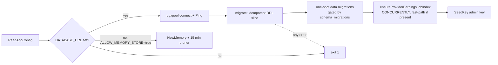

# Storage

> Last updated: 2026-09-05 · commit `4d9811f7c`

What the coordinator persists, through which interface, in which backend, and
how the schema reaches a fresh database; then what a provider keeps on its own
disk and in its Keychain. Read this to understand what survives a restart, what
does not, and which files an operator may touch. Configuration values are
listed once in [`../reference/configuration.md`](../reference/configuration.md);
the SSD cache file format is in
[`../reference/ssd-kv-cache.md`](../reference/ssd-kv-cache.md).

Model versions also store the optional `hugging_face_artifact` as nullable JSONB
(`coordinator/store/postgres.go`). `SetModelVersion` replaces it and invalidates
the existing model read-through cache; [artifact schema](../reference/model-registry-format.md#hugging-face-download-artifact).

## Context

The coordinator is a single Go process whose in-memory registry is rebuilt from
provider connections after every restart. Everything that must outlive a
process — accounts and keys, the money ledger, usage, the model catalog,
releases, provider trust decisions and telemetry — goes through one `Store`
value chosen at boot. Providers are the opposite: a `darkbloom` daemon keeps a
handful of small JSON files under `~/.darkbloom`, its weights in the Hugging
Face cache, an encrypted SSD prefix cache, and one key-encryption key in the
Keychain. Nothing prompt-derived is stored on either side.

## Mechanism

### The store interface

`Store` (`coordinator/store/interface.go`) is the union of twelve domain
interfaces declared in `coordinator/store/interface_domains.go`. Callers depend
on the narrow slice they need; both implementations satisfy all twelve.

| Sub-interface | Owns |
|---|---|
| `APIKeyStore` | Consumer API keys: create, seed, validate, per-key limits and counts. |
| `UsageStore` | Usage events and settled payments plus the totals, time-series, geo and leaderboard aggregations behind `/v1/stats`. |
| `TelemetryStore` | Routing-decision snapshots (`inference_routes`), rejection records and the profiler's `request_profiles`/`fleet_snapshots`; prompt-free by construction. |
| `LedgerStore` | The double-entry balance ledger; every amount is micro-USD. |
| `BillingStore` | Referrals, deposit sessions, per-account model prices and Stripe Connect withdrawals. |
| `ModelRegistryStore` | The manifest-backed model catalog and the public aliases that resolve to concrete builds. |
| `ReleaseStore` | Versioned provider binary releases and their hashes. |
| `UserStore` | Privy-linked consumer accounts, role, platform-fee override and Stripe Connect payout fields. |
| `DeviceAuthStore` | The RFC 8628-style device-code flow and the long-lived provider tokens it mints. |
| `InviteStore` | Invite codes and redemptions. |
| `ProviderEarningsStore` | Per-node earnings, payouts and the base-rewards settlement rows. |
| `ProviderStore` | Provider records and sessions, reputation, the APNs code-identity and trust-reuse caches, verification jobs and log reports. |

Telemetry *events* are not in the store at all: `TelemetryEventRecord` goes to
Datadog only (see [`telemetry.md`](telemetry.md)).

### Two implementations and when each runs

| Backend | File | Selected when | Durability |
|---|---|---|---|
| `PostgresStore` | `coordinator/store/postgres.go` (+ `postgres_*.go`) | `EIGENINFERENCE_DATABASE_URL` is set | Durable; the only backend for dev and production. In production the database is AWS RDS, outside the coordinator VM and its container, so a container swap or VM reboot cannot touch it ([`../operations/coordinator-deploy.md`](../operations/coordinator-deploy.md)). |
| `MemoryStore` | `coordinator/store/memory.go` | No DSN **and** `EIGENINFERENCE_ALLOW_MEMORY_STORE=true` | Process memory; everything is lost on exit. |

Selection is in `main` (`coordinator/cmd/coordinator/main.go`): with a DSN it
calls `store.NewPostgres` and exits 1 on any connect, ping or migration error;
without one it refuses to start unless the memory store is explicitly allowed
(`store.Config.Check`). The memory store is for tests and local hacking, not a
"simple deployment" — it has no fsync'd trust-reuse journal, no durable code
attestations, and the admin key exists only because `store.NewMemory` received
it in `store.Config`.

### Connecting to Postgres

`NewPostgres` parses the DSN with `pgxpool.ParseConfig` and overrides the pool
shape: at least 80 max connections, 10 minimum, 30 minute connection lifetime,
5 minute idle timeout, 30 second health check. The 80 floor exists because the
stats endpoint can hold connections for seconds while heartbeat upserts,
billing settlements and inference completions also need them. The DSN itself is
the only connection-level knob; there is no separate host/user/password set.

### Migrations run inside the process, at every boot

There is no migration tool and no versioned migration directory for the
schema. `PostgresStore.migrate` (`coordinator/store/postgres.go`) executes an
ordered slice of idempotent statements — `CREATE TABLE IF NOT EXISTS`,
`ADD COLUMN IF NOT EXISTS`, `CREATE INDEX IF NOT EXISTS`, `DROP TABLE IF EXISTS`
for retired tables — on every start, then three post-loop steps:
`migrateUsageTotals` (`postgres_usage_totals_migration.go`),
`migrateWithdrawableBalance` (`postgres_withdrawable_migration.go`) and
`ensureProviderEarningsJobIndex`. One-shot *data* migrations are gated by a row
in `schema_migrations` so they run at most once. Two SQL files under
`coordinator/store/migrations/` are deliberately **not** on that path and are
applied by hand with `psql`: `dedupe_provider_earnings.sql` (an offline cleanup
that once ran at boot, held a relation lock for ~15 minutes on the production
table and kept the coordinator from binding its port) and
`request_waterfall.sql` (an analysis view joining `request_profiles` to
`inference_routes`, kept off the boot path so a `CREATE VIEW` can never queue
behind a long query's lock). `coordinator/deploy/start.sh` does not touch the
database; it only prepares the persistent disk and MicroMDM before `exec
coordinator`.

### Table families

Roughly forty tables; grouped by what would be lost if the family vanished.

| Family | Tables | Notes |
|---|---|---|
| Identity and access | `api_keys`, `users`, `device_codes`, `provider_tokens`, `publishing_api_keys`, `invite_codes`, `invite_redemptions` | Keys are stored as hashes with a display prefix; `users` carries the Stripe Connect fields. |
| Money | `balances`, `ledger_entries`, `billing_sessions`, `model_prices`, `referrers`, `referrals`, `stripe_withdrawals`, `global_payout_recipients`, `global_payout_withdrawals`, `provider_earnings`, `earnings_summary`, `provider_payouts`, `provider_floor_draws`, `payments` (legacy) | The ledger is append-only; `balances` is the materialised view of it. Semantics in [`billing.md`](billing.md). |
| Usage and routing telemetry | `usage`, `usage_totals`, `inference_routes`, `request_rejections`, `request_profiles`, `fleet_snapshots` | Row per request, per dispatched attempt, per rejection, per profiled attempt, per fleet sample; `usage_totals` is a single-row counter kept by `migrateUsageTotals`. |
| Provider fleet and trust | `providers`, `provider_reputation`, `provider_sessions`, `provider_trust_reuse`, `provider_verification_jobs`, `code_attestations`, `code_attest_push_budgets`, `provider_log_reports` | Trust reuse and code attestations are durable so a redeploy does not re-challenge the whole fleet; see [`security/attestation.md`](security/attestation.md). `provider_log_reports.serial_number` is kept empty by trigger. |
| Models and releases | `model_registry`, `model_versions`, `model_version_files`, `model_active_versions`, `model_aliases`, `releases` | The catalog the registry syncs at boot; see [`model-registry.md`](model-registry.md). |
| Bookkeeping | `schema_migrations` | Markers for one-shot data migrations. |

### Retention and pruning

The store keeps most business rows forever; the loops that exist are narrow.

| Loop | Where | What it bounds |
|---|---|---|
| Profiler retention sweep, hourly | `coordinator/api/profiler_fleet.go` (`StartProfilerLoops` → `PruneTelemetry`) | `request_profiles` and `fleet_snapshots` older than their retention windows ([telemetry-inventory](../reference/telemetry-inventory.md#coordinator-per-request-records-postgres)), in batches; runs even when the profiler is off. |
| Memory-store pruner, every 15 minutes | `coordinator/cmd/coordinator/main.go` (`memory_store_pruner`, `MemoryStore.Prune`) | Append-only history slices to `DefaultPruneMaxEntries` (100 000); memory store only. |
| Session reconciliation, once at boot | `coordinator/cmd/coordinator/main.go` (`CloseOpenProviderSessions`) | Closes `provider_sessions` rows whose last heartbeat is more than 3 minutes old, so a blue-green cutover does not truncate live sessions. |
| Read-cache janitor, every minute | `coordinator/api/server.go` (`StartReadCacheJanitor`) | In-process response cache, not a table. |

The existing nullable `request_rejections.could_have_served` column stores NULL
when counterfactual servability is not evaluated. Go reads it as `*bool`
(`coordinator/store/interface.go`, `RejectionRecord`); both stores preserve
unknown, false, and true. This requires no schema migration.

`usage`, `inference_routes`, `request_rejections` and `ledger_entries` have no
automatic retention. `DeleteExpiredDeviceCodes` exists on the interface but has
no scheduled caller.

### Provider-side local storage

| What | Where | Owner |
|---|---|---|
| Configuration | `~/.config/darkbloom/provider.toml` (legacy `~/.darkbloom/provider.toml` is still read) | `provider-swift/Sources/ProviderCore/Config/ProviderConfig.swift` |
| Device-auth token | `~/.darkbloom/auth_token` | `provider-swift/Sources/ProviderCore/Auth/DeviceAuth.swift` |
| Daemon state, PID, warm-model journal, watchdog state, KV-backend crash guard | `~/.darkbloom/daemon-state.json`, `provider.pid`, `loaded-models.json`, `watchdog-state.json`, `kv-backend-guard.json` | `provider-swift/Sources/ProviderCore/Service/` |
| Direct-mode token and discovery file | `~/.darkbloom/local_token`, `~/.darkbloom/local.json` | `provider-swift/Sources/ProviderCore/Server/LocalEndpoint.swift` |
| Logs | `~/.darkbloom/provider.log`, `~/.darkbloom/watchdog.log`; unified logging via `darkbloom logs` | `provider-swift/Sources/ProviderCore/Service/LaunchAgent.swift`, `WatchdogAgent.swift` |
| Binaries | `~/.darkbloom/Darkbloom.app`, symlinks in `~/.darkbloom/bin/` | `scripts/install.sh` |
| Model weights | `~/.cache/huggingface/hub` | `provider-swift/Sources/ProviderCore/Models/ModelDownloader.swift` |
| SSD prefix cache | `~/Library/Caches/darkbloom/kv3/<model>/` — encrypted blocks; default budget under [size and eviction rules](../reference/ssd-kv-cache.md#size-and-eviction-rules) | `provider-swift/Sources/ProviderCore/KVCacheSSD/SSDPrefixCacheFactory.swift`; format in [`../reference/ssd-kv-cache.md`](../reference/ssd-kv-cache.md) |
| KV key-encryption key | Keychain item, service `io.darkbloom.kv.kek.v1`, access group `SLDQ2GJ6TL.io.darkbloom.provider`, wrapped by a Secure Enclave key | `provider-swift/Sources/ProviderCore/KVCache/WrappedKEKStorage.swift`, `Security/PersistentEnclaveKey.swift` |
| Fan helper policy | `/Library/Application Support/Darkbloom/fan-policy.json`, `fan-session.json` | [`../provider/fan-control.md`](../provider/fan-control.md) |

Every file path in the first four rows can be moved with the `DARKBLOOM_*`
variables in [`../reference/configuration.md`](../reference/configuration.md).
Sealed request plaintext never reaches disk on a provider; the SSD cache holds
KV blocks under a per-model key, not tokens.

## Invariants

1. **A production coordinator never runs on the memory store.**
   `store.Config.Check` fails and `main` exits unless a DSN is present or the
   memory store is opted into by name (`coordinator/store/config.go`,
   `coordinator/cmd/coordinator/main.go`).
2. **Schema changes ship with the binary and are idempotent.** Every statement
   in `PostgresStore.migrate` can run on an already-migrated database; the
   process serves traffic only after the whole slice succeeds
   (`coordinator/store/postgres.go`).
3. **One-shot data migrations run at most once.** They test and insert their
   marker in `schema_migrations` inside the same statement
   (`coordinator/store/postgres.go`).
4. **Boot never holds a long lock on a hot table.** The
   `provider_earnings(job_id)` unique index is built `CONCURRENTLY`, only after
   a duplicate check, and skipped when already valid; the dedupe that violated
   this lives in `coordinator/store/migrations/dedupe_provider_earnings.sql` and
   is manual (`ensureProviderEarningsJobIndex`).
5. **Money is micro-USD integers in an append-only ledger.** `LedgerStore`
   and `balances` never store floats; see
   [`billing.md#invariants`](billing.md#invariants).
6. **Nothing prompt-derived is persisted.** `TelemetryStore` rows carry token
   counts, timings and outcomes only; the `serial_number` column of
   `provider_log_reports` and the legacy `cache_affinity_key` column are kept
   empty by triggers (`coordinator/store/postgres_log_report_privacy.go`,
   `legacyCacheAffinityGuardTrigger` in `coordinator/store/postgres.go`).
7. **Provider secrets never leave the Keychain in the clear.** The KV KEK is
   wrapped by a Secure Enclave key and the SSD cache is unreadable without it
   (`provider-swift/Sources/ProviderCore/KVCache/WrappedKEKStorage.swift`).

## Failure modes

| Symptom | Cause | Where to look |
|---|---|---|
| Coordinator exits 1 at boot with `store: run migrations` | A DDL statement failed (permissions, a hand-edited schema, or a `CREATE INDEX` waiting on a lock) | The logged statement; `pg_stat_activity` for blockers. |
| Boot fails with an actionable `provider_earnings` duplicate message | Rows share a non-empty `job_id`, so the unique index cannot be built | Run `dedupe_provider_earnings.sql` offline, then redeploy. |
| `EIGENINFERENCE_DATABASE_URL is required in production` | No DSN and no memory-store opt-in | The environment file; see [`../operations/coordinator-deploy.md`](../operations/coordinator-deploy.md). |
| Billing or key state gone after a restart | The process ran on the memory store | Startup log line `using in-memory store`. |
| `/v1/stats` slow and pool saturated | Full scans on `usage` holding connections; the 80-connection floor is the mitigation, not a fix | `pg_stat_activity`; the read cache. |
| `request_waterfall` view missing after a fresh database | It is applied by hand, not at boot | `coordinator/store/migrations/request_waterfall.sql`. |
| Provider re-challenged after every coordinator deploy | Trust-reuse rows missing (memory store) or `provider_trust_reuse` revoked | [`security/attestation.md`](security/attestation.md). |
| Provider SSD cache empty after reboot | Budget clamp or block TTL ([size and eviction rules](../reference/ssd-kv-cache.md#size-and-eviction-rules)), or the KEK item missing | [`../reference/ssd-kv-cache.md`](../reference/ssd-kv-cache.md); `darkbloom doctor`. |

## Code map

| Concern | Location |
|---|---|
| Interface and record types | `coordinator/store/interface.go`, `coordinator/store/interface_domains.go` |
| Backend selection and validation | `coordinator/store/config.go`, `coordinator/cmd/coordinator/main.go` |
| Postgres pool, schema, one-shot migrations | `coordinator/store/postgres.go`, `coordinator/store/postgres_usage_totals_migration.go`, `coordinator/store/postgres_withdrawable_migration.go`, `coordinator/store/postgres_log_report_privacy.go` |
| Domain files | `coordinator/store/postgres_model_registry.go`, `coordinator/store/postgres_base_rewards.go`, `coordinator/store/postgres_profiles.go`, `coordinator/store/route_telemetry.go`, `coordinator/store/usage_time_series.go`, `coordinator/store/apikey.go` |
| Memory backend | `coordinator/store/memory.go`, `coordinator/store/memory_base_rewards.go` |
| Manual SQL | `coordinator/store/migrations/` |
| Persistent-disk state outside Postgres (MicroMDM, journals) | `coordinator/deploy/start.sh`, `coordinator/api/trust_reuse_journal.go`, [`../operations/state-export.md`](../operations/state-export.md) |
| Provider files and Keychain | `provider-swift/Sources/ProviderCore/Config/ProviderConfig.swift`, `provider-swift/Sources/ProviderCore/Service/`, `provider-swift/Sources/ProviderCore/KVCacheSSD/`, `provider-swift/Sources/ProviderCore/KVCache/WrappedKEKStorage.swift` |

## Related

- [`../reference/configuration.md`](../reference/configuration.md) — `EIGENINFERENCE_DATABASE_URL`, `EIGENINFERENCE_ALLOW_MEMORY_STORE`, `USER_PERSISTENT_DATA_PATH` and the provider path overrides
- [`billing.md`](billing.md) — what the money tables mean
- [`telemetry.md`](telemetry.md) and [`system-profiler.md`](system-profiler.md) — what fills the telemetry tables
- [`model-registry.md`](model-registry.md) — the catalog tables
- [`security/attestation.md`](security/attestation.md) — the trust-reuse and code-attestation caches
- [`prefix-cache.md`](prefix-cache.md) and [`../reference/ssd-kv-cache.md`](../reference/ssd-kv-cache.md) — the provider's on-disk cache
- [`../operations/state-export.md`](../operations/state-export.md) — exporting the non-Postgres state on the persistent disk
- [`../operations/coordinator-deploy.md`](../operations/coordinator-deploy.md) — where the DSN is set

Global Payouts uses separate recipient and withdrawal tables with immutable request data, persisted dispatch counts and a unique external-payment index. `GlobalPayoutStore` is accessed through `store.As` so decorators preserve the capability. These mutations do not write the cached users table. The initial migration creates new tables only (`coordinator/store/global_payouts_postgres.go`, `globalPayoutSchema`).
